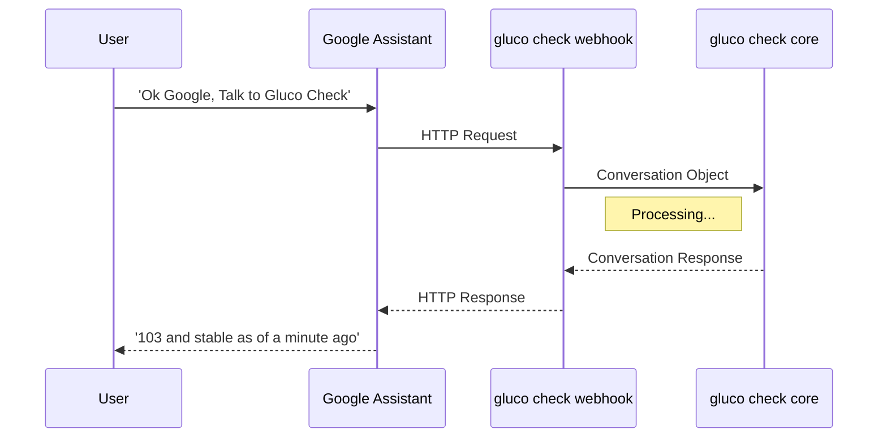
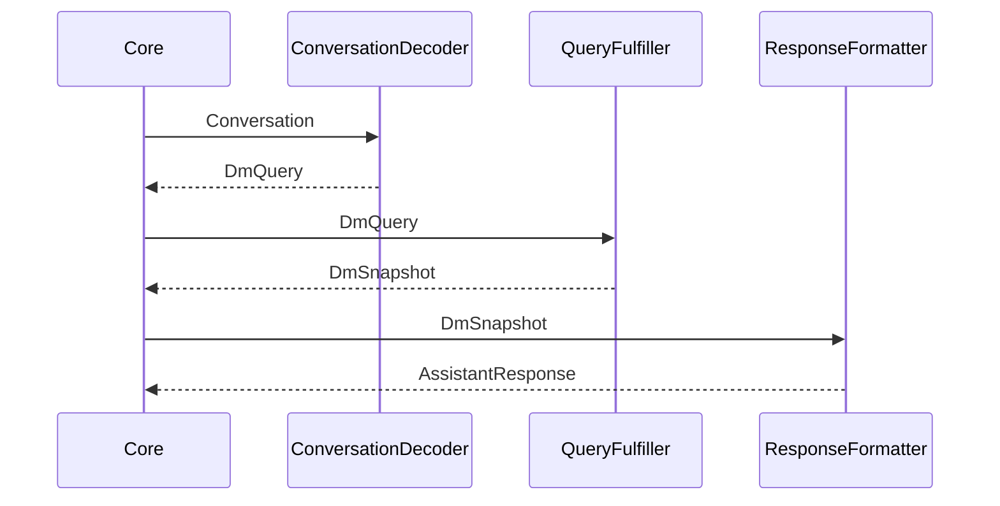
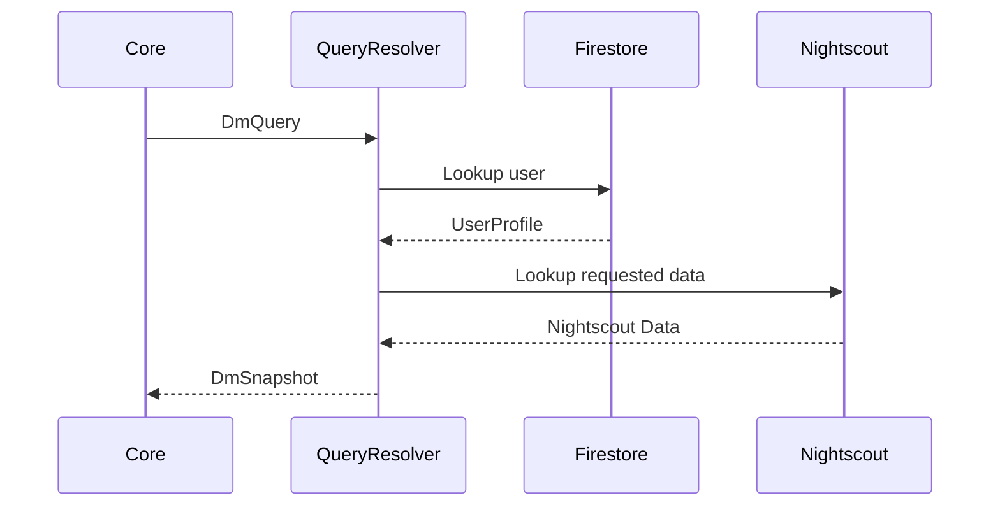

# Contributing

First off, thanks for taking the time to contribute! 🎉👍

### 🙋‍♀️ Who's this document for?

- For _you_:  
  If you want to contribute, reading this document if the fastest way to understanding the codebase
- For _myself_ (the creator of Gluco Check):  
  If I'm coming back to this project after working on something else for a while, this doc will quickly get me reacquainted

### 📖 What's in this document?

1. Setting up a DEV environment
2. The project architecture explained

---

## 1. Setting up your dev environment

### 🔧 Tools

- Yarn 1.x (required)
- Node 12 or higher (required)
- Visual Studio Code (recommended)
- [Firebase Tools] (required for package `gluco-check-webhooks`)
- [Google Actions CLI] (required for package `gluco-check-action`)

[firebase tools]: https://www.npmjs.com/package/firebase-tools
[google actions cli]: https://developers.google.com/assistant/conversational/df-asdk/actions-sdk/gactions-cli

### 📦 Project setup

In the repo's root folder, run:

```shell
yarn # Link packages together and install dependencies
```

---

## 2. Architecture explanation

Gluco Check is a monorepo managed by Yarn Workspaces. There are 5 separate packages, each with their own purpose:

### [gluco-check-action](./gluco-check-action)

Contains the Google Action definition that is deployed to Google Assistant.

The Actions is built using [Google Actions Builder]. Its definition can then be exported to YAML files using the [`gactions`] CLI.  
Deploying the Action to Google Assistant can be done from the CLI as well.

There are 2 ways to invoke the Action:

- _Main invocation:_ Hey Google, talk to Gluco Check
- _Deep invocation:_ Hey Google, ask Gluco Check for my glucose and IOB

When invoked, Google calls our webhook (see `gluco-check-webhooks`) to get a response.

[google actions builder]: https://console.actions.google.com
[`gactions`]: https://developers.google.com/assistant/conversational/df-asdk/actions-sdk/gactions-cli

### [gluco-check-common](./gluco-check-common)

This is where we store translated strings. [Crowdin] automatically updates these YAML files with new translations.

`yarn build` converts the YAML to JSON.

[Crowdin]: (https://crowdin.com)

### [gluco-check-webhooks](./gluco-check-webhooks)

There are two webhooks. They are deployed as [Firebase] HTTP functions.

[firebase]: https://firebase.google.com

- **validateUrl**:  
  Used by the web interface to check if the Nightscout URL a user has entered is valid.

- **conversation**:  
  Called by Google Actions. When a request comes in, it is routed to the `core` package for processing. (see further)

Run `yarn deploy` to deploy the webhooks to Firebase.

### [gluco-check-core](./gluco-check-core)

#### Glossary (aka: Types)

###### DmMetric
Any piece of diabetes-related info a user wants to keep track of is a _DmMetric_ (Diabetes Mellitus Metric)  
Examples of DmMetrics include: `[glucose, insulin on board, sensor age, ...]`
Consider this query: "Ok Google, ask Gluco Check for my `glucose` and `iob`".  
Here, we're asking for 2 DmMetrics: glucose and insulin on board.

###### DmQuery
When a user asks for 1 or more *DmMetrics*, we can express this as a *DmQuery*
For example the question: "What's my `glucose` and `iob`?" is a *DmQuery* with the following properties:

```
requestedDmMetrics: [glucose, iob]
metadata: (determines how Gluco Check should respond)
  language: English
  ...
```

###### DmSnapshot
A *DmSnapshot* represents the state of someone's diabetes at a single point in time. It's a collection of *DmMetrics* and their corresponding values.  
For example, at 1 PM on Feb 3rd my *DmSnapshot* could have looked like this:
```
timestamp: 1580734800
glucoseValue: 103
glucoseUnit: mg/dl
...
```

#### Logical Flow

_(the snippets below are [Mermaid] Diagrams, but GitHub can't display them yet. Open this file in an editor like [Typora] to see them, or install this [browser extension])_

[Mermaid]: https://mermaid-js.github.io/mermaid-live-editor
[browser extension]: https://github.com/BackMarket/github-mermaid-extension
[Typora]: https://typora.io/

##### When a user says: _'Ok Google, talk to Gluco Check'_:
1. The Google Assistant invokes our webhook
2. Using the Google Actions SDK, `gluco-check-webhook` transforms the HTTP request into a `Conversation` object
3. The `Conversation` is passed through `gluco-check-core` to build a response
4. The response is said back to the user


##### When `gluco-check-core` receives a `Conversation` object:
1. It is passed to `ConversationDecoder` to find out what exactly the user is asking for
2. `ConversationDecoder` returns a `DmQuery` with the requested `DmMetrics`
3. `DmQuery` is passed through `DmQueryFulfiller` to get the requested info from Nightscout
4. `QueryFulfiller` returns a `DmSnapsot`: the requested `DmMetrics` and their corresponding values
5. `DmSnapshot` is passed through `ResponseFormatter`, which returns a string the Assistant can say back


##### When `QueryResolver` receives a `DmQuery`:
1. It get the user's profile from Firestore (this contains their Nightscout URL and token)
2. Fetches the required data from their Nightscout site
3. Merges the data from Nightscout together into a `DmSnapshot`, and returns it


##### When `ResponseFormatter` receives a `DmSnapshot`:
 ```
 TODO: Update docs
 ```
